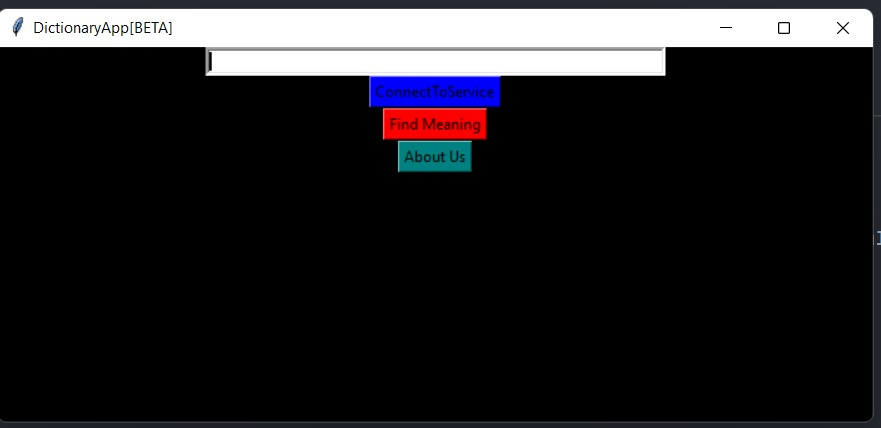

# Dictionary App
A Smart Dictionary Application to search a word's meaning easily with the convenience of a smooth Python GUI. 
The App automatically suggests correct word spellings if you make a typo :)

## Take a look:

## Future Development
- Synonyms and Antonyms Addition  <!--WordNet for getting meanings, Google for translations, and synonym.com for getting synonyms and antonyms.-->
- Use of API based service(Currenty Uses and queries a Local Json Data)
- Language Based Translations[Work in Progress]
- Enhanced Suggestion capabilities  

#### Requirements:
  - json
  - difflib
  - tkinter
  - threading
  - dload
  - urllib3

Built by Mohit Chandak and Rutuj Runwal. 
&copy; All Rights Reserved under MIT License
